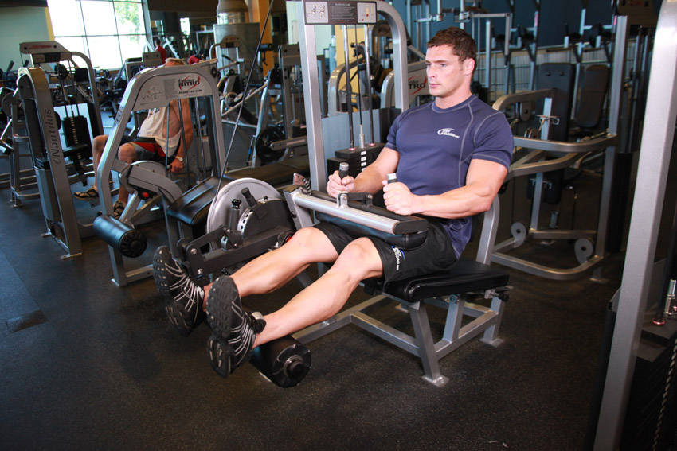

# 坐姿腿弯举

**Seated Leg Curl**

> 部位：腿臀　|　器械：固定器械　|　难度：⭐ 新手　|　类型：力量训练 · 孤立动作 · 拉

## 目标肌群

- **主要**：腘绳肌（大腿后侧）
- **协同**：—

## 动作示意图

| 起始位 | 结束位 |
|:---:|:---:|
|  |  |

## 动作要点

1. 坐姿调整器械，让膝关节刚好在垫子边缘、转轴对齐。
2. 脚踝后侧卡在滚轴下方，双手握住把手稳定身体。
3. 呼气，脚跟朝臀部方向勾起，用腘绳肌发力而不是甩小腿。
4. 顶峰收缩一秒，感受大腿后侧完全缩短。
5. 吸气缓慢放回，直到腿接近伸直但保留张力。

## 常见错误

- ❌ 臀部抬离垫子借力 → 腰部代偿
- ❌ 靠惯性甩动 → 腘绳肌几乎没受力
- ❌ 幅度过小 → 顶峰没收紧、底部没拉长
- ✅ 轴心对齐、臀部贴垫、慢起慢落

## 训练建议

3–4 组 × 10–15 次，组间休息 45–75 秒；小重量找目标肌群的收缩感。

<b>英文原始步骤 / Original Instructions</b>（点击展开）

1. Adjust the machine lever to fit your height and sit on the machine with your back against the back support pad.
2. Place the back of lower leg on top of padded lever (just a few inches under the calves) and secure the lap pad against your thighs, just above the knees. Then grasp the side handles on the machine as you point your toes straight (or you can also use any of the other two stances) and ensure that the legs are fully straight right in front of you. This will be your starting position.
3. As you exhale, pull the machine lever as far as possible to the back of your thighs by flexing at the knees. Keep your torso stationary at all times. Hold the contracted position for a second.
4. Slowly return to the starting position as you breathe in.
5. Repeat for the recommended amount of repetitions.

---

[← 返回腿臀部位索引](README.md)　|　[返回首页](../../README.md)

数据与图片来源：[yuhonas/free-exercise-db](https://github.com/yuhonas/free-exercise-db)（The Unlicense，公有领域）　·　中文名称、动作要点与内容组织：Yue（gengyueworks）
