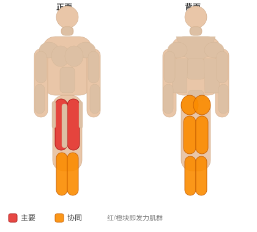
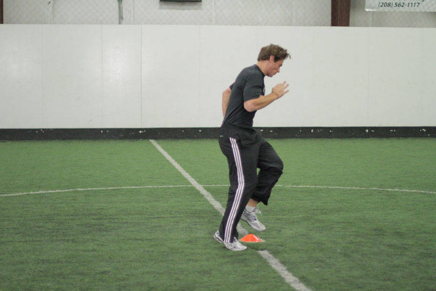

# 单标志锥冲刺跑

**Single-Cone Sprint Drill**

> 部位：腿臀　|　器械：其他　|　难度：⭐ 新手　|　类型：爆发力/弹跳 · — · 推

## 目标肌群

- **主要**：股四头肌（大腿前侧）
- **协同**：小腿（腓肠肌/比目鱼肌）、臀大肌、腘绳肌（大腿后侧）

## 肌肉激活示意

🔴 主要肌群　🟠 协同肌群（红/橙块即发力部位，鼠标悬停看名称）

## 动作示意图

| 起始位 | 结束位 |
|:---:|:---:|
|  |  |

## 动作要点

1. 先用 5 分钟低强度让心率逐步上升，不要一上来就冲。
2. 保持躯干直立、肩膀放松，避免含胸或死撑扶手。
3. 按目标控制强度：减脂多用中低强度长时间，提升心肺可用间歇。
4. 呼吸保持节奏，能勉强说出完整句子大约是中等强度。
5. 结束前留 3–5 分钟低强度整理活动，让心率平稳降下来。

## 常见错误

- ❌ 全程死抓扶手 → 实际消耗远低于显示数值
- ❌ 强度骤起骤停 → 心血管负担大
- ❌ 含胸驼背 → 呼吸受限、腰颈不适
- ✅ 循序渐进、姿态挺拔、有热身有整理

## 训练建议

3–5 组 × 3–6 次，组间充分休息 2–3 分钟；追求每一次的质量，疲劳后立即停止。

<b>英文原始步骤 / Original Instructions</b>（点击展开）

1. This drill teaches quick foot action. You need a single cone. Begin standing next to the cone with one arm back and one arm forward.
2. Chop the feet as quickly as possible, blocking with the arms. Circle the cone, keep your knees up, with violent foot action.
3. Rest after three trips around the cone.

---

[← 返回腿臀部位索引](README.md)　|　[返回首页](../../README.md)

数据与图片来源：[yuhonas/free-exercise-db](https://github.com/yuhonas/free-exercise-db)（The Unlicense，公有领域）　·　中文名称、动作要点与内容组织：Yue（gengyueworks）