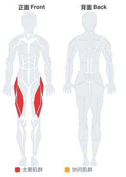
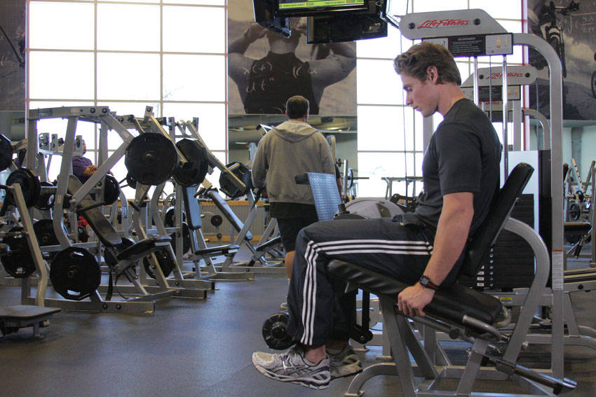

# 单腿坐姿腿屈伸

**Single-Leg Leg Extension**

> 部位：腿臀　|　器械：固定器械　|　难度：⭐ 新手　|　类型：力量训练 · 孤立动作 · 推

## 目标肌群

- **主要**：股四头肌（大腿前侧）
- **协同**：—

## 肌肉激活示意

🔴 主要肌群　🟠 协同肌群（红/橙块即发力部位，鼠标悬停看名称）

## 动作示意图

| 起始位 | 结束位 |
|:---:|:---:|
|  |  |

## 动作要点

1. 坐好，调整靠背让膝关节转轴与器械转轴对齐。
2. 滚轴卡在脚踝上方（小腿下段），不是压在脚背上。
3. 双手握住扶手固定身体，呼气伸直双腿。
4. 顶峰主动挤压股四头肌一秒，感受大腿前侧收紧。
5. 吸气用 2–3 秒缓慢屈腿放回，全程保持张力。

## 常见错误

- ❌ 靠身体前后晃动甩腿 → 借力且膝关节受冲击
- ❌ 滚轴压在脚背/脚踝上 → 踝关节疼痛
- ❌ 大重量猛踢到锁死 → 膝关节剪切力大
- ✅ 轴心对齐、匀速伸展、顶峰挤压

## 训练建议

3–4 组 × 10–15 次，组间休息 45–75 秒；小重量找目标肌群的收缩感。

<b>英文原始步骤 / Original Instructions</b>（点击展开）

1. Seat yourself in the machine and adjust it so that you are positioned properly. The pad should be against the lower part of the shin but not in contact with the ankle. Adjust the seat so that the pivot point is in line with your knee. Select a weight appropriate for your abilities.
2. Maintaining good posture, fully extend one leg, pausing at the top of the motion.
3. Return to the starting position without letting the weight stop, keeping tension on the muscle.
4. Repeat for the desired number of repetitions.

---

[← 返回腿臀部位索引](README.md)　|　[返回首页](../../README.md)

数据与图片来源：[yuhonas/free-exercise-db](https://github.com/yuhonas/free-exercise-db)（The Unlicense，公有领域）　·　中文名称、动作要点与内容组织：Yue（gengyueworks）