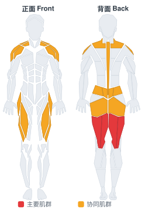
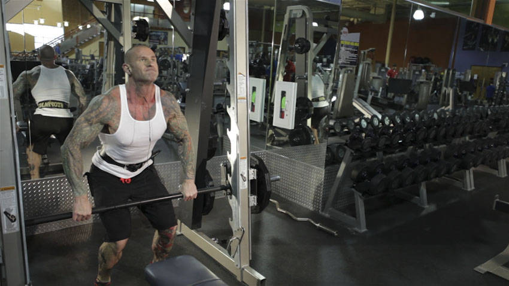

# 史密斯机悬垂高翻

**Smith Machine Hang Power Clean**

> 部位：腿臀　|　器械：固定器械　|　难度：⭐⭐ 进阶　|　类型：力量训练 · 复合动作 · 拉

## 目标肌群

- **主要**：腘绳肌（大腿后侧）
- **协同**：臀大肌、下背（竖脊肌）、股四头肌（大腿前侧）、三角肌、斜方肌

## 肌肉激活示意

🔴 主要肌群　🟠 协同肌群（红/橙块即发力部位，鼠标悬停看名称）

## 动作示意图

| 起始位 | 结束位 |
|:---:|:---:|
|  |  |

## 动作要点

1. 这是技术性极高的举重动作，强烈建议先在教练指导下用空杆学习动作模式。
2. 起始姿势：杠贴小腿，挺胸收肩胛，背部中立，核心绷紧。
3. 第一发力：用腿把杠「推离」地面，保持背角不变，杠贴腿上行。
4. 第二发力：过膝后爆发式伸髋伸膝、耸肩提肘，把杠加速向上。
5. 接杠：迅速下潜到接杠位置稳住，站起完成，然后有控制地放下杠铃。

## 常见错误

- ❌ 用手臂拉杠 → 手臂只负责传导，发力靠髋腿
- ❌ 杠远离身体走弧线 → 力臂变大，几乎必失败
- ❌ 未掌握技术就上大重量 → 受伤风险极高
- ✅ 空杆练技术、杠贴身走、髋腿主导发力

## 训练建议

3–5 组 × 6–12 次，组间休息 90–150 秒；先把动作做标准再加重量。

<b>英文原始步骤 / Original Instructions</b>（点击展开）

1. Position the bar at knee height and load it to an appropriate weight.
2. Take a pronated grip on the bar outside of shoulder width and unhook the bar from the machine. Your arms should be fully extended with your head and chest up. Your elbows should be pointed out with your shoulders back and down. Your hips should be back, loading the tension into the hamstrings. This will be your starting position.
3. Initate the movement by forcefully extending the hips and knees, accelerating into the bar. Ensure that you keep your arms straight during this part of the motion.
4. Upon full extension, rebend the hips and knees to lower your receiving position.
5. Allow the arms to flex at this point, rotating the elbows around the bar to receive it on your shoulders.
6. Extend through the hips and knees to come to a standing position with the bar racked on your shoulders to complete the movement.

---

[← 返回腿臀部位索引](README.md)　|　[返回首页](../../README.md)

数据与图片来源：[yuhonas/free-exercise-db](https://github.com/yuhonas/free-exercise-db)（The Unlicense，公有领域）　·　中文名称、动作要点与内容组织：Yue（gengyueworks）