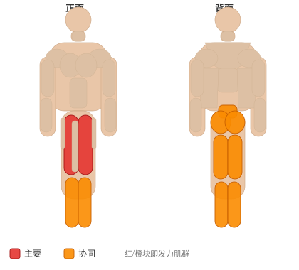
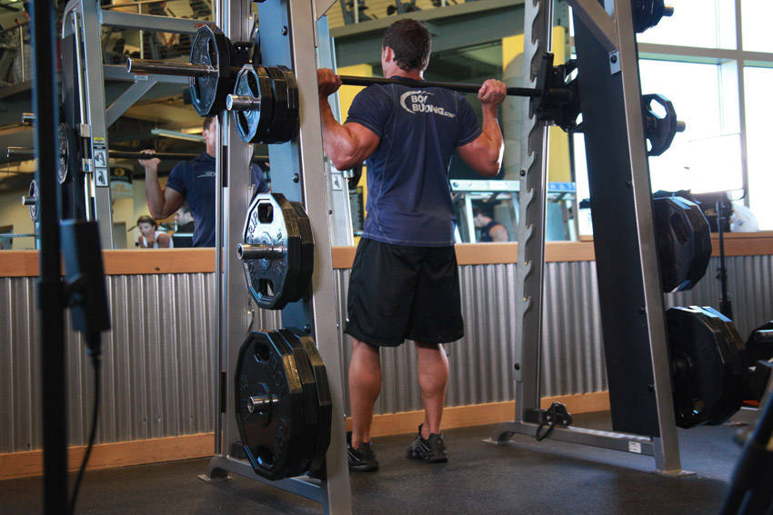

# 史密斯机深蹲

**Smith Machine Squat**

> 部位：腿臀　|　器械：固定器械　|　难度：⭐ 新手　|　类型：力量训练 · 复合动作 · 推

## 目标肌群

- **主要**：股四头肌（大腿前侧）
- **协同**：小腿（腓肠肌/比目鱼肌）、臀大肌、腘绳肌（大腿后侧）、下背（竖脊肌）

## 肌肉激活示意

🔴 主要肌群　🟠 协同肌群（红/橙块即发力部位，鼠标悬停看名称）

## 动作示意图

| 起始位 | 结束位 |
|:---:|:---:|
|  |  |

## 动作要点

1. 固定器械稳定在背部斜方肌上（或按动作要求持握），双脚与肩同宽、脚尖略外展。
2. 吸气、核心收紧，想象「用腹部顶住一条腰带」再下蹲。
3. 髋部先向后向下坐，膝盖始终朝脚尖方向打开，不要内扣。
4. 蹲到大腿与地面平行或更低（以能保持腰背中立为准）。
5. 呼气蹬地起身，全脚掌发力，顶端髋部前顶，膝盖不锁死。

## 常见错误

- ❌ 膝盖内扣 → 半月板和韧带受损的首要原因
- ❌ 脚跟离地 → 重心前移，压力全给膝盖前侧
- ❌ 底部弓腰（俗称「屁股眨眼」） → 腰椎受剪切力
- ✅ 膝盖跟脚尖同向、全脚掌踩实、核心全程绷住

## 训练建议

3–5 组 × 6–12 次，组间休息 90–150 秒；先把动作做标准再加重量。

<b>英文原始步骤 / Original Instructions</b>（点击展开）

1. To begin, first set the bar on the height that best matches your height. Once the correct height is chosen and the bar is loaded, step under the bar and place the back of your shoulders (slightly below the neck) across it.
2. Hold on to the bar using both arms at each side (palms facing forward), unlock it and lift it off the rack by first pushing with your legs and at the same time straightening your torso.
3. Position your legs using a shoulder width medium stance with the toes slightly pointed out. Keep your head up at all times and also maintain a straight back. This will be your starting position. (Note: For the purposes of this discussion we will use the medium stance which targets overall development; however you can choose any of the three stances discussed in the foot stances section).
4. Begin to slowly lower the bar by bending the knees as you maintain a straight posture with the head up. Continue down until the angle between the upper leg and the calves becomes slightly less than 90-degrees (which is the point in which the upper legs are below parallel to the floor). Inhale as you perform this portion of the movement. Tip: If you performed the exercise correctly, the front of the knees should make an imaginary straight line with the toes that is perpendicular to the front. If your knees are past that imaginary line (if they are past your toes) then you are placing undue stress on the knee and the exercise has been performed incorrectly.
5. Begin to raise the bar as you exhale by pushing the floor with the heel of your foot as you straighten the legs again and go back to the starting position.
6. Repeat for the recommended amount of repetitions.

---

[← 返回腿臀部位索引](README.md)　|　[返回首页](../../README.md)

数据与图片来源：[yuhonas/free-exercise-db](https://github.com/yuhonas/free-exercise-db)（The Unlicense，公有领域）　·　中文名称、动作要点与内容组织：Yue（gengyueworks）