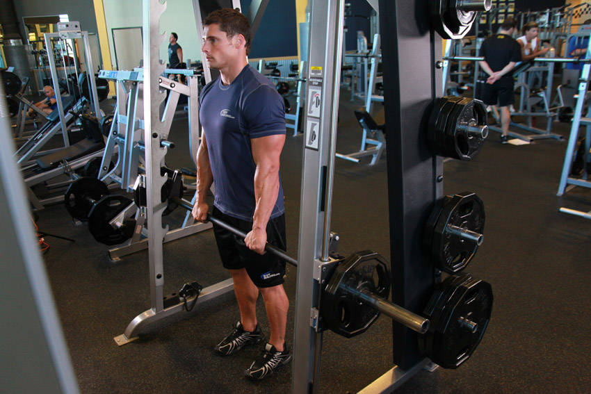

# 史密斯机直腿硬拉

**Smith Machine Stiff-Legged Deadlift**

> 部位：腿臀　|　器械：固定器械　|　难度：⭐ 新手　|　类型：力量训练 · 复合动作 · 拉

## 目标肌群

- **主要**：腘绳肌（大腿后侧）
- **协同**：臀大肌、下背（竖脊肌）

## 动作示意图

| 起始位 | 结束位 |
|:---:|:---:|
|  |  |

## 动作要点

1. 双脚约与髋同宽，固定器械贴近小腿，杠位于脚掌中部正上方。
2. 屈髋屈膝下去握杠，挺胸收肩胛，背部保持中立——这一步最关键。
3. 吸气憋住核心，先用腿把地面「蹬开」，杠贴着腿向上走。
4. 髋膝同步伸展，过膝后髋部前顶站直，顶端夹紧臀部但不要后仰。
5. 下放时先屈髋把杠沿腿送下去，过膝再屈膝，保持背部中立。

## 常见错误

- ❌ 弓背起杠 → 腰椎间盘压力剧增，最危险的错误
- ❌ 杠离小腿太远 → 力臂变长，腰部代偿
- ❌ 顶端过度后仰 → 腰椎超伸，没有额外收益
- ✅ 杠贴腿走、背部中立、髋膝同步、顶端只需站直

## 训练建议

3–5 组 × 6–12 次，组间休息 90–150 秒；先把动作做标准再加重量。

<b>英文原始步骤 / Original Instructions</b>（点击展开）

1. To begin, set the bar on the smith machine to a height that is around the middle of your thighs. Once the correct height is chosen and the bar is loaded, grasp the bar using a pronated (palms forward) grip that is shoulder width apart. You may need some wrist wraps if using a significant amount of weight.
2. Lift the bar up by fully extending your arms while keeping your back straight. Stand with your torso straight and your legs spaced using a shoulder width or narrower stance. The knees should be slightly bent. This is your starting position.
3. Keeping the knees stationary, lower the barbell to over the top of your feet by bending at the waist while keeping your back straight. Keep moving forward as if you were going to pick something from the floor until you feel a stretch on the hamstrings. Exhale as you perform this movement
4. Start bringing your torso up straight again as soon as you feel the hamstrings stretch by extending your hips and waist until you are back at the starting position. Inhale as you perform this movement.
5. Repeat for the recommended amount of repetitions.

---

[← 返回腿臀部位索引](README.md)　|　[返回首页](../../README.md)

数据与图片来源：[yuhonas/free-exercise-db](https://github.com/yuhonas/free-exercise-db)（The Unlicense，公有领域）　·　中文名称、动作要点与内容组织：Yue（gengyueworks）
