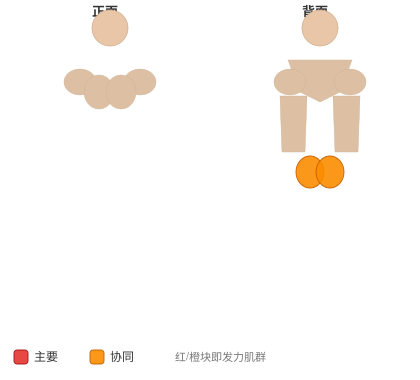
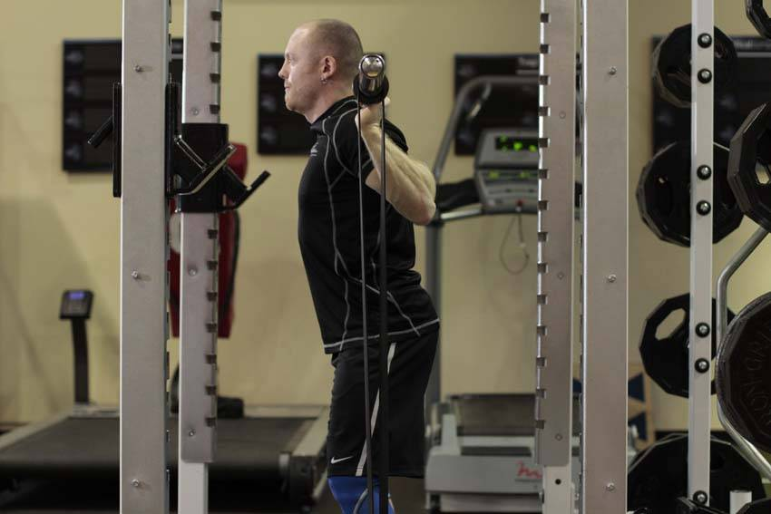

# 弹力带深蹲

**Squat with Bands**

> 部位：腿臀　|　器械：杠铃　|　难度：⭐⭐ 进阶　|　类型：力量举 · 复合动作 · 推

## 目标肌群

- **主要**：股四头肌（大腿前侧）
- **协同**：髋内收肌（大腿内侧）、小腿（腓肠肌/比目鱼肌）、臀大肌、腘绳肌（大腿后侧）、下背（竖脊肌）

## 肌肉激活示意

🔴 主要肌群　🟠 协同肌群（红/橙块即发力部位，鼠标悬停看名称）

## 动作示意图

| 起始位 | 结束位 |
|:---:|:---:|
|  |  |

## 动作要点

1. 杠铃稳定在背部斜方肌上（或按动作要求持握），双脚与肩同宽、脚尖略外展。
2. 吸气、核心收紧，想象「用腹部顶住一条腰带」再下蹲。
3. 髋部先向后向下坐，膝盖始终朝脚尖方向打开，不要内扣。
4. 蹲到大腿与地面平行或更低（以能保持腰背中立为准）。
5. 呼气蹬地起身，全脚掌发力，顶端髋部前顶，膝盖不锁死。

## 常见错误

- ❌ 膝盖内扣 → 半月板和韧带受损的首要原因
- ❌ 脚跟离地 → 重心前移，压力全给膝盖前侧
- ❌ 底部弓腰（俗称「屁股眨眼」） → 腰椎受剪切力
- ✅ 膝盖跟脚尖同向、全脚掌踩实、核心全程绷住

## 训练建议

3–5 组 × 1–5 次，组间休息 3–5 分钟；大重量务必有人保护。

<b>英文原始步骤 / Original Instructions</b>（点击展开）

1. Set up the bands on the sleeves, secured to either band pegs, the rack, or dumbbells so that there is appropriate tension.
2. Begin by stepping under the bar and placing it across the back of the shoulders. Squeeze your shoulder blades together and rotate your elbows forward, attempting to bend the bar across your shoulders. Remove the bar from the rack, creating a tight arch in your lower back, and step back into position. Place your feet wide for more emphasis on the back, glutes, adductors, and hamstrings. Keep your head facing forward.
3. With your back, shoulders, and core tight, push your knees and butt out and you begin your descent. Sit back with your hips as much as possible. Ideally, your shins should be perpendicular to the ground. Lower bar position necessitates a greater torso lean to keep the bar over the heels. Continue until you break parallel, which is defined as the crease of the hip being in line with the top of the knee.
4. Keeping the weight on your heels and pushing your feet and knees out, drive upward as you lead the movement with your head. Continue upward, maintaining tightness head to toe, until you have returned to the starting position.

---

[← 返回腿臀部位索引](README.md)　|　[返回首页](../../README.md)

数据与图片来源：[yuhonas/free-exercise-db](https://github.com/yuhonas/free-exercise-db)（The Unlicense，公有领域）　·　中文名称、动作要点与内容组织：Yue（gengyueworks）