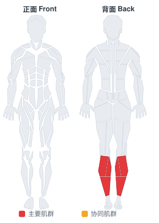
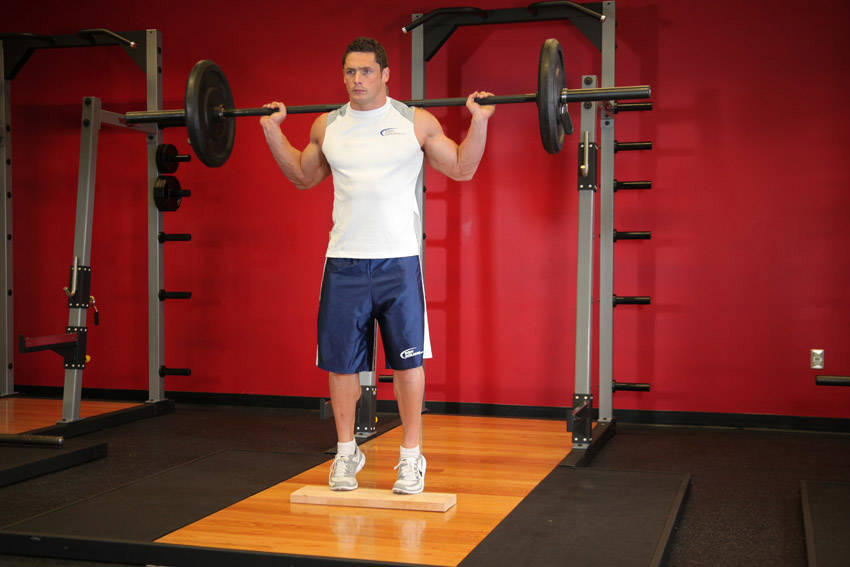

# 站姿杠铃提踵

**Standing Barbell Calf Raise**

> 部位：腿臀　|　器械：杠铃　|　难度：⭐ 新手　|　类型：力量训练 · 孤立动作 · 推

## 目标肌群

- **主要**：小腿（腓肠肌/比目鱼肌）
- **协同**：—

## 肌肉激活示意

🔴 主要肌群　🟠 协同肌群（红/橙块即发力部位，鼠标悬停看名称）

## 动作示意图

| 起始位 | 结束位 |
|:---:|:---:|
|  |  |

## 动作要点

1. 站姿前脚掌踩在踏板边缘，脚跟悬空，杠铃提供负荷。
2. 吸气，脚跟尽量下沉，让小腿充分拉长——底部拉伸是关键。
3. 呼气，前脚掌发力踮到最高，像要用脚趾站起来。
4. 顶峰停顿 1 秒挤压小腿，再用 2 秒缓慢下放。
5. 小腿耐受度高，建议 15–25 次的较高次数区间。

## 常见错误

- ❌ 快速弹动做半程 → 靠跟腱弹性，肌肉不受力
- ❌ 幅度小、脚跟不下沉 → 丢掉最有效的拉长段
- ❌ 膝盖大幅弯曲借力 → 变成小腿摆动
- ✅ 大幅度、慢速、顶峰停顿

## 训练建议

3–4 组 × 10–15 次，组间休息 45–75 秒；小重量找目标肌群的收缩感。

<b>英文原始步骤 / Original Instructions</b>（点击展开）

1. This exercise is best performed inside a squat rack for safety purposes. To begin, first set the bar on a rack that best matches your height. Once the correct height is chosen and the bar is loaded, step under the bar and place the bar on the back of your shoulders (slightly below the neck).
2. Hold on to the bar using both arms at each side and lift it off the rack by first pushing with your legs and at the same time straightening your torso.
3. Step away from the rack and position your legs using a shoulder width medium stance with the toes slightly pointed out. Keep your head up at all times as looking down will get you off balance and also maintain a straight back. The knees should be kept with a slight bend; never locked. This will be your starting position. Tip: For better range of motion you may also place the ball of your feet on a wooden block but be careful as this option requires more balance and a sturdy block.
4. Raise your heels as you breathe out by extending your ankles as high as possible and flexing your calf. Ensure that the knee is kept stationary at all times. There should be no bending at any time. Hold the contracted position by a second before you start to go back down.
5. Go back slowly to the starting position as you breathe in by lowering your heels as you bend the ankles until calves are stretched.
6. Repeat for the recommended amount of repetitions.

---

[← 返回腿臀部位索引](README.md)　|　[返回首页](../../README.md)

数据与图片来源：[yuhonas/free-exercise-db](https://github.com/yuhonas/free-exercise-db)（The Unlicense，公有领域）　·　中文名称、动作要点与内容组织：Yue（gengyueworks）