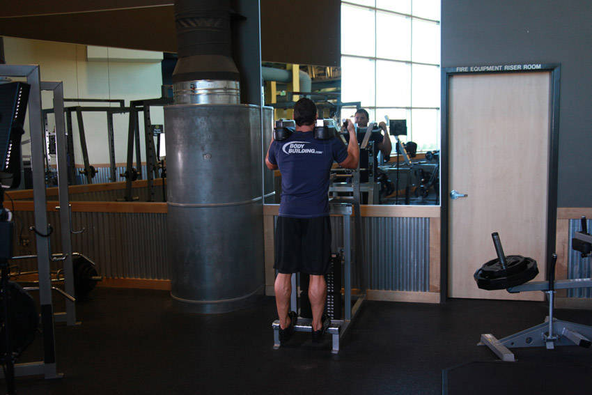

# 站姿提踵

**Standing Calf Raises**

> 部位：腿臀　|　器械：固定器械　|　难度：⭐ 新手　|　类型：力量训练 · 孤立动作 · 推

## 目标肌群

- **主要**：小腿（腓肠肌/比目鱼肌）
- **协同**：—

## 动作示意图

| 起始位 | 结束位 |
|:---:|:---:|
|  |  |

## 动作要点

1. 站姿前脚掌踩在踏板边缘，脚跟悬空，固定器械提供负荷。
2. 吸气，脚跟尽量下沉，让小腿充分拉长——底部拉伸是关键。
3. 呼气，前脚掌发力踮到最高，像要用脚趾站起来。
4. 顶峰停顿 1 秒挤压小腿，再用 2 秒缓慢下放。
5. 小腿耐受度高，建议 15–25 次的较高次数区间。

## 常见错误

- ❌ 快速弹动做半程 → 靠跟腱弹性，肌肉不受力
- ❌ 幅度小、脚跟不下沉 → 丢掉最有效的拉长段
- ❌ 膝盖大幅弯曲借力 → 变成小腿摆动
- ✅ 大幅度、慢速、顶峰停顿

## 训练建议

3–4 组 × 10–15 次，组间休息 45–75 秒；小重量找目标肌群的收缩感。

<b>英文原始步骤 / Original Instructions</b>（点击展开）

1. Adjust the padded lever of the calf raise machine to fit your height.
2. Place your shoulders under the pads provided and position your toes facing forward (or using any of the two other positions described at the beginning of the chapter). The balls of your feet should be secured on top of the calf block with the heels extending off it. Push the lever up by extending your hips and knees until your torso is standing erect. The knees should be kept with a slight bend; never locked. Toes should be facing forward, outwards or inwards as described at the beginning of the chapter. This will be your starting position.
3. Raise your heels as you breathe out by extending your ankles as high as possible and flexing your calf. Ensure that the knee is kept stationary at all times. There should be no bending at any time. Hold the contracted position by a second before you start to go back down.
4. Go back slowly to the starting position as you breathe in by lowering your heels as you bend the ankles until calves are stretched.
5. Repeat for the recommended amount of repetitions.

---

[← 返回腿臀部位索引](README.md)　|　[返回首页](../../README.md)

数据与图片来源：[yuhonas/free-exercise-db](https://github.com/yuhonas/free-exercise-db)（The Unlicense，公有领域）　·　中文名称、动作要点与内容组织：Yue（gengyueworks）
