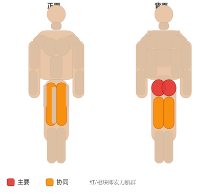

# 登阶（举膝）

**Step-up with Knee Raise**

> 部位：腿臀　|　器械：自重　|　难度：⭐ 新手　|　类型：力量训练 · 复合动作 · 推

## 目标肌群

- **主要**：臀大肌
- **协同**：腘绳肌（大腿后侧）、股四头肌（大腿前侧）

## 肌肉激活示意

🔴 主要肌群　🟠 协同肌群（红/橙块即发力部位，鼠标悬停看名称）

## 动作示意图

| 起始位 | 结束位 |
|:---:|:---:|
|  |  |

## 动作要点

1. 持自身体重，双脚前后分开约一大步，躯干保持直立。
2. 核心收紧，吸气垂直下蹲，后膝向地面靠近但不触地。
3. 前膝保持在脚尖上方或略后，膝盖朝脚尖方向。
4. 呼气，用前脚跟发力蹬起，重心始终压在前腿上。
5. 一侧做完再换另一侧，或按动作要求交替进行。

## 常见错误

- ❌ 前膝超过脚尖过多 → 膝关节压力大
- ❌ 上半身前倾晃动 → 失去平衡且臀腿卸力
- ❌ 步幅太小 → 变成半蹲，臀部参与不足
- ✅ 垂直起落、前脚跟发力、躯干挺直

## 训练建议

3–5 组 × 6–12 次，组间休息 90–150 秒；先把动作做标准再加重量。

<b>英文原始步骤 / Original Instructions</b>（点击展开）

1. Stand facing a box or bench of an appropriate height with your feet together. This will be your starting position.
2. Begin the movement by stepping up, putting your left foot on the top of the bench. Extend through the hip and knee of your front leg to stand up on the box. As you stand on the box with your left leg, flex your right knee and hip, bringing your knee as high as you can.
3. Reverse this motion to step down off the box, and then repeat the sequence on the opposite leg.

---

[← 返回腿臀部位索引](README.md)　|　[返回首页](../../README.md)

数据与图片来源：[yuhonas/free-exercise-db](https://github.com/yuhonas/free-exercise-db)（The Unlicense，公有领域）　·　中文名称、动作要点与内容组织：Yue（gengyueworks）