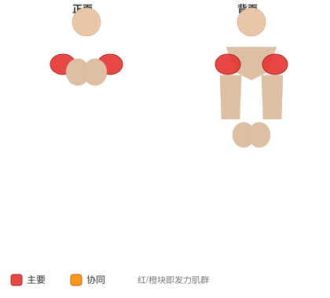
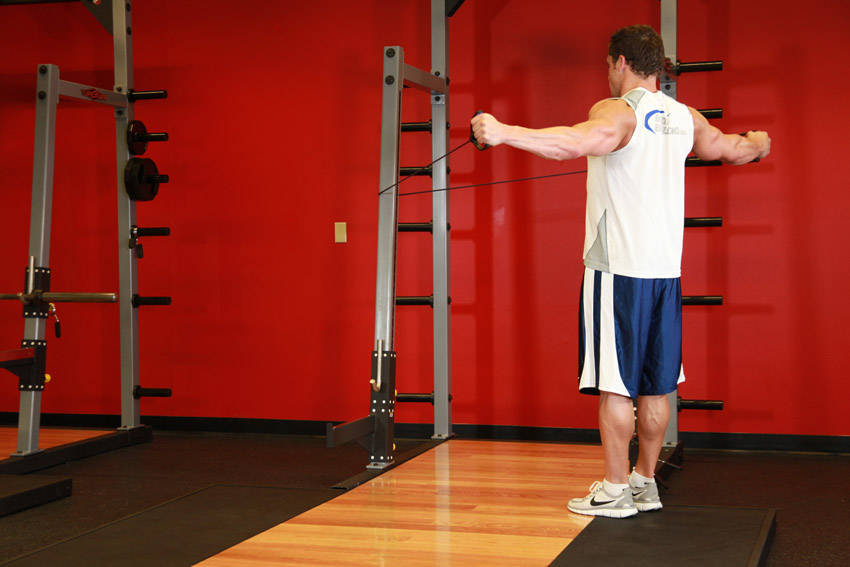

# 背飞鸟（弹力带）

**Back Flyes - With Bands**

> 部位：肩　|　器械：弹力带　|　难度：⭐ 新手　|　类型：力量训练 · 复合动作 · 拉

## 目标肌群

- **主要**：三角肌
- **协同**：中背（菱形肌/斜方肌中束）、肱三头肌

## 肌肉激活示意

🔴 主要肌群　🟠 协同肌群（红/橙块即发力部位，鼠标悬停看名称）

## 动作示意图

| 起始位 | 结束位 |
|:---:|:---:|
|  |  |

## 动作要点

1. 调整好位置，双手持弹力带，手肘保持一个固定的微屈角度——整组都不要改变这个角度。
2. 肩胛骨收紧下沉，胸腔打开，这是发力的起点。
3. 吸气，双臂沿弧线向两侧缓慢打开，感受三角肌被拉长，到略低于肩的位置即可。
4. 呼气，想象「用胸把两只手挤到一起」，沿同样的弧线合拢。
5. 顶峰主动挤压三角肌一秒再放，飞鸟练的是张力不是重量。

## 常见错误

- ❌ 手肘一屈一伸变成了卧推 → 胸肌刺激大打折扣
- ❌ 打开幅度过大越过身体平面 → 肩关节前侧受伤
- ❌ 重量过大靠甩 → 全程失去控制
- ✅ 固定肘角、小重量、找挤压感

## 训练建议

3–5 组 × 6–12 次，组间休息 90–150 秒；先把动作做标准再加重量。

<b>英文原始步骤 / Original Instructions</b>（点击展开）

1. Run a band around a stationary post like that of a squat rack.
2. Grab the band by the handles and stand back so that the tension in the band rises.
3. Extend and lift the arms straight in front of you. Tip: Your arms should be straight and parallel to the floor while perpendicular to your torso. Your feet should be firmly planted on the floor spread at shoulder width. This will be your starting position.
4. As you exhale, move your arms to the sides and back. Keep your arms extended and parallel to the floor. Continue the movement until the arms are extended to your sides.
5. After a pause, go back to the original position as you inhale.
6. Repeat for the recommended amount of repetitions.

---

[← 返回肩部位索引](README.md)　|　[返回首页](../../README.md)

数据与图片来源：[yuhonas/free-exercise-db](https://github.com/yuhonas/free-exercise-db)（The Unlicense，公有领域）　·　中文名称、动作要点与内容组织：Yue（gengyueworks）