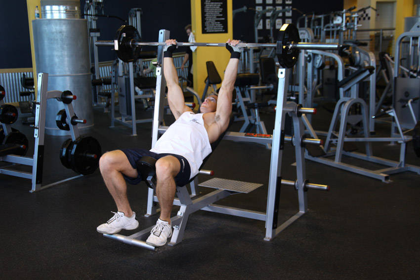
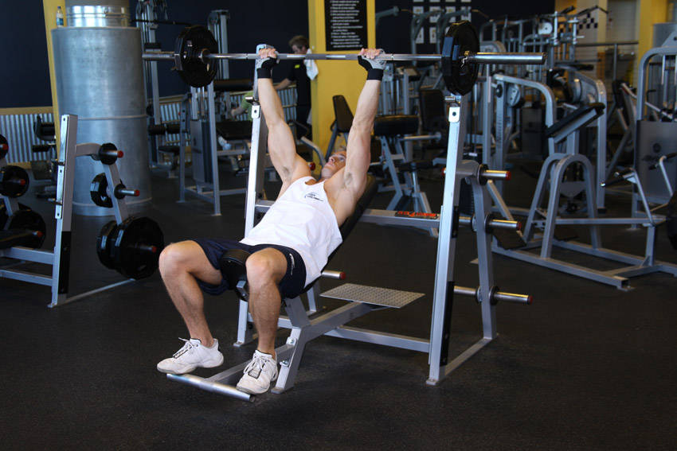

# 杠铃上斜肩上举

**Barbell Incline Shoulder Raise**

> 部位：肩　|　器械：杠铃　|　难度：⭐ 新手　|　类型：力量训练 · 复合动作 · 推

## 目标肌群

- **主要**：三角肌
- **协同**：胸大肌

## 动作示意图

| 起始位 | 结束位 |
|:---:|:---:|
|  |  |

## 动作要点

1. 上斜持杠铃置于身体两侧，手肘保持微屈，肩膀主动下沉。
2. 呼气，用肩部带动手臂向侧上方抬起，想象「用手肘领着走」。
3. 抬到与肩同高即可，再高就变成斜方肌发力了。
4. 顶端停顿半秒，吸气用 2–3 秒缓慢下放，离心才是涨点。
5. 全程小重量、不借力，三角肌有灼烧感就对了。

## 常见错误

- ❌ 耸肩、用斜方肌把重量甩起来 → 练错肌肉
- ❌ 上半身前后晃动借力 → 重量选大了
- ❌ 抬过肩高 → 三角肌中束卸力
- ✅ 沉肩、肘领先、抬到肩高、慢放

## 训练建议

3–5 组 × 6–12 次，组间休息 90–150 秒；先把动作做标准再加重量。

<b>英文原始步骤 / Original Instructions</b>（点击展开）

1. Lie back on an Incline Bench. Using a medium width grip (a grip that is slightly wider than shoulder width), lift the bar from the rack and hold it straight over you with your arms straight. This will be your starting position.
2. While keeping the arms straight, lift the bar by protracting your shoulder blades, raising the shoulders from the bench as you breathe out.
3. Bring back the bar to the starting position as you breathe in.
4. Repeat for the recommended amount of repetitions.

---

[← 返回肩部位索引](README.md)　|　[返回首页](../../README.md)

数据与图片来源：[yuhonas/free-exercise-db](https://github.com/yuhonas/free-exercise-db)（The Unlicense，公有领域）　·　中文名称、动作要点与内容组织：Yue（gengyueworks）
