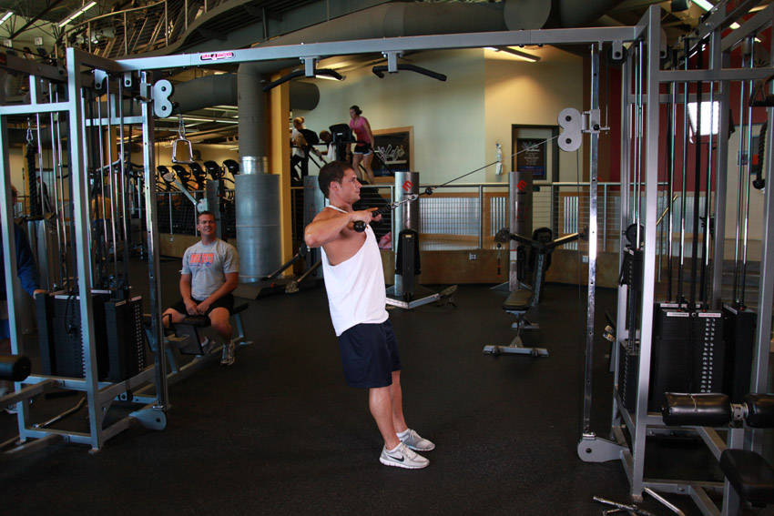

# 绳索后侧三角肌划船

**Cable Rope Rear-Delt Rows**

> 部位：肩　|　器械：绳索　|　难度：⭐ 新手　|　类型：力量训练 · 复合动作 · 拉

## 目标肌群

- **主要**：三角肌
- **协同**：肱二头肌、中背（菱形肌/斜方肌中束）

## 动作示意图

| 起始位 | 结束位 |
|:---:|:---:|
|  |  |

## 动作要点

1. 握住绳索，脊柱保持中立，核心收紧，避免弓背。
2. 起始时让肩胛骨自然前伸，背阔肌被拉长。
3. 呼气，先收肩胛再用手肘向后拉，把绳索带向腹部或下肋位置。
4. 顶峰挤压背部一秒，两侧肩胛向中间夹紧。
5. 吸气缓慢还原，全程躯干稳定不摇摆。

## 常见错误

- ❌ 弓背拉重量 → 腰椎受伤风险最高的错误
- ❌ 靠躯干起伏甩上来 → 背部没吃上力
- ❌ 手肘外展太多 → 变成练后束而非背阔肌
- ✅ 中立脊柱、先收肩胛、肘贴身后拉

## 训练建议

3–5 组 × 6–12 次，组间休息 90–150 秒；先把动作做标准再加重量。

<b>英文原始步骤 / Original Instructions</b>（点击展开）

1. Sit in the same position on a low pulley row station as you would if you were doing seated cable rows for the back.
2. Attach a rope to the pulley and grasp it with an overhand grip. Your arms should be extended and parallel to the floor with the elbows flared out.
3. Keep your lower back upright and slide your hips back so that your knees are slightly bent. This will be your starting position.
4. Pull the cable attachment towards your upper chest, just below the neck, as you keep your elbows up and out to the sides. Continue this motion as you exhale until the elbows travel slightly behind the back. Tip: Keep your upper arms horizontal, perpendicular to the torso and parallel to the floor throughout the motion.
5. Go back to the initial position where the arms are extended and the shoulders are stretched forward. Inhale as you perform this portion of the movement.
6. Repeat for the recommended amount of repetitions.

---

[← 返回肩部位索引](README.md)　|　[返回首页](../../README.md)

数据与图片来源：[yuhonas/free-exercise-db](https://github.com/yuhonas/free-exercise-db)（The Unlicense，公有领域）　·　中文名称、动作要点与内容组织：Yue（gengyueworks）
