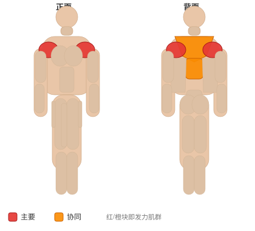
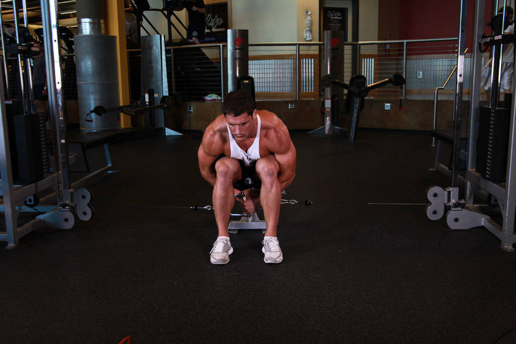
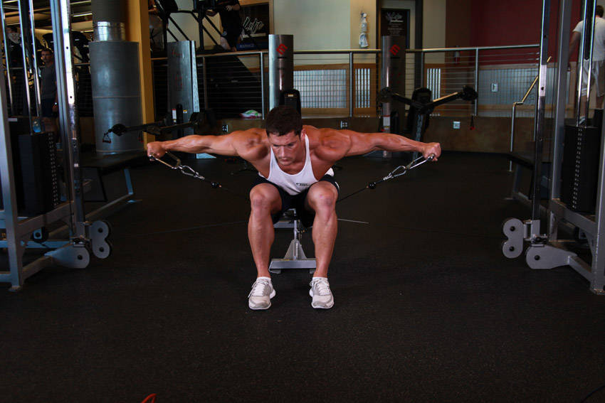

# 绳索坐姿侧平举

**Cable Seated Lateral Raise**

> 部位：肩　|　器械：绳索　|　难度：⭐ 新手　|　类型：力量训练 · 孤立动作 · 拉

## 目标肌群

- **主要**：三角肌
- **协同**：中背（菱形肌/斜方肌中束）、斜方肌

## 肌肉激活示意

🔴 主要肌群　🟠 协同肌群（红/橙块即发力部位，鼠标悬停看名称）

## 动作示意图

| 起始位 | 结束位 |
|:---:|:---:|
|  |  |

## 动作要点

1. 坐姿持绳索置于身体两侧，手肘保持微屈，肩膀主动下沉。
2. 呼气，用肩部带动手臂向侧上方抬起，想象「用手肘领着走」。
3. 抬到与肩同高即可，再高就变成斜方肌发力了。
4. 顶端停顿半秒，吸气用 2–3 秒缓慢下放，离心才是涨点。
5. 全程小重量、不借力，三角肌有灼烧感就对了。

## 常见错误

- ❌ 耸肩、用斜方肌把重量甩起来 → 练错肌肉
- ❌ 上半身前后晃动借力 → 重量选大了
- ❌ 抬过肩高 → 三角肌中束卸力
- ✅ 沉肩、肘领先、抬到肩高、慢放

## 训练建议

3–4 组 × 10–15 次，组间休息 45–75 秒；小重量找目标肌群的收缩感。

<b>英文原始步骤 / Original Instructions</b>（点击展开）

1. Stand in the middle of two low pulleys that are opposite to each other and place a flat bench right behind you (in perpendicular fashion to you; the narrow edge of the bench should be the one behind you). Select the weight to be used on each pulley.
2. Now sit at the edge of the flat bench behind you with your feet placed in front of your knees.
3. Bend forward while keeping your back flat and rest your torso on the thighs.
4. Have someone give you the single handles attached to the pulleys. Grasp the left pulley with the right hand and the right pulley with the left after you select your weight. The pulleys should run under your knees and your arms will be extended with palms facing each other and a slight bend at the elbows. This will be the starting position.
5. While keeping the arms stationary, raise the upper arms to the sides until they are parallel to the floor and at shoulder height. Exhale during the execution of this movement and hold the contraction for a second.
6. Slowly lower your arms to the starting position as you inhale.
7. Repeat for the recommended amount of repetitions. Tip: Maintain upper arms perpendicular to torso and a fixed elbow position (10 degree to 30 degree angle) throughout exercise.

---

[← 返回肩部位索引](README.md)　|　[返回首页](../../README.md)

数据与图片来源：[yuhonas/free-exercise-db](https://github.com/yuhonas/free-exercise-db)（The Unlicense，公有领域）　·　中文名称、动作要点与内容组织：Yue（gengyueworks）