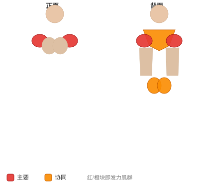
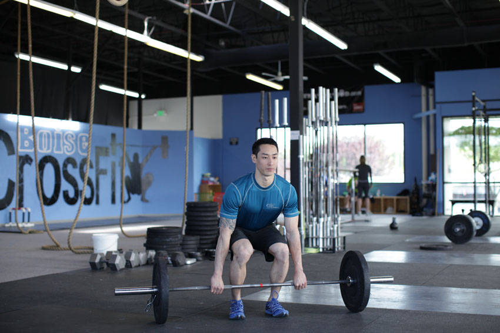

# 翻站推举

**Clean and Press**

> 部位：肩　|　器械：杠铃　|　难度：⭐⭐ 进阶　|　类型：力量训练 · 复合动作 · 推

## 目标肌群

- **主要**：三角肌
- **协同**：腹肌、小腿（腓肠肌/比目鱼肌）、臀大肌、腘绳肌（大腿后侧）、下背（竖脊肌）、中背（菱形肌/斜方肌中束）、股四头肌（大腿前侧）、三角肌、斜方肌、肱三头肌

## 肌肉激活示意

🔴 主要肌群　🟠 协同肌群（红/橙块即发力部位，鼠标悬停看名称）

## 动作示意图

| 起始位 | 结束位 |
|:---:|:---:|
|  |  |

## 动作要点

1. 这是技术性极高的举重动作，强烈建议先在教练指导下用空杆学习动作模式。
2. 起始姿势：杠贴小腿，挺胸收肩胛，背部中立，核心绷紧。
3. 第一发力：用腿把杠「推离」地面，保持背角不变，杠贴腿上行。
4. 第二发力：过膝后爆发式伸髋伸膝、耸肩提肘，把杠加速向上。
5. 接杠：迅速下潜到接杠位置稳住，站起完成，然后有控制地放下杠铃。

## 常见错误

- ❌ 用手臂拉杠 → 手臂只负责传导，发力靠髋腿
- ❌ 杠远离身体走弧线 → 力臂变大，几乎必失败
- ❌ 未掌握技术就上大重量 → 受伤风险极高
- ✅ 空杆练技术、杠贴身走、髋腿主导发力

## 训练建议

3–5 组 × 6–12 次，组间休息 90–150 秒；先把动作做标准再加重量。

<b>英文原始步骤 / Original Instructions</b>（点击展开）

1. Assume a shoulder-width stance, with knees inside the arms. Now while keeping the back flat, bend at the knees and hips so that you can grab the bar with the arms fully extended and a pronated grip that is slightly wider than shoulder width. Point the elbows out to sides. The bar should be close to the shins. Position the shoulders over or slightly ahead of the bar. Establish a flat back posture. This will be your starting position.
2. Begin to pull the bar by extending the knees. Move your hips forward and raise the shoulders at the same rate while keeping the angle of the back constant; continue to lift the bar straight up while keeping it close to your body.
3. As the bar passes the knee, extend at the ankles, knees, and hips forcefully, similar to a jumping motion. As you do so, continue to guide the bar with your hands, shrugging your shoulders and using the momentum from your movement to pull the bar as high as possible. The bar should travel close to your body, and you should keep your elbows out.
4. At maximum elevation, your feet should clear the floor and you should start to pull yourself under the bar. The mechanics of this could change slightly, depending on the weight used. You should descend into a squatting position as you pull yourself under the bar.
5. As the bar hits terminal height, rotate your elbows around and under the bar. Rack the bar across the front of the shoulders while keeping the torso erect and flexing the hips and knees to absorb the weight of the bar.
6. Stand to full height, holding the bar in the clean position.
7. Without moving your feet, press the bar overhead as you exhale. Lower the bar under control .

---

[← 返回肩部位索引](README.md)　|　[返回首页](../../README.md)

数据与图片来源：[yuhonas/free-exercise-db](https://github.com/yuhonas/free-exercise-db)（The Unlicense，公有领域）　·　中文名称、动作要点与内容组织：Yue（gengyueworks）