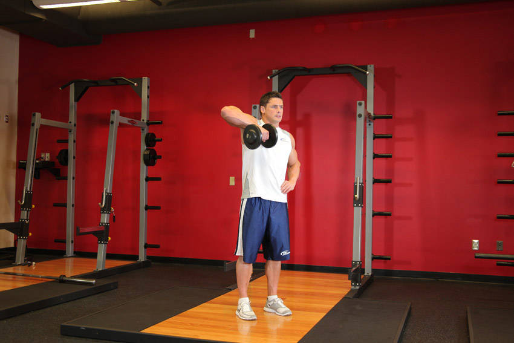
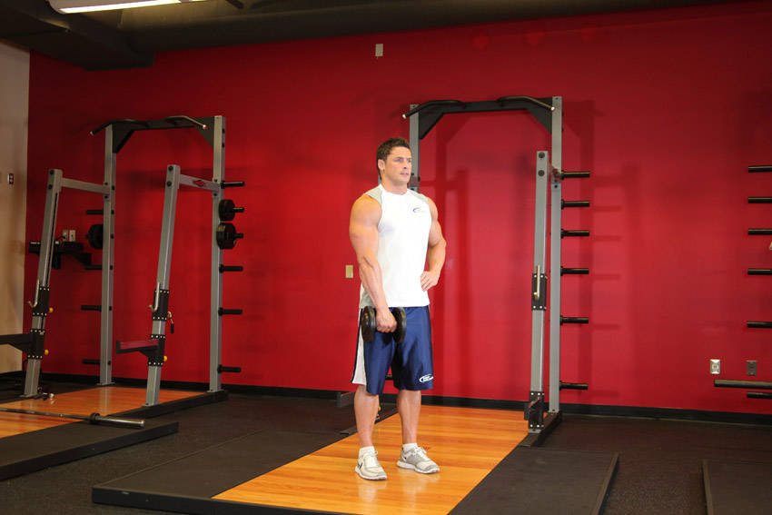

# 哑铃单臂直立划船

**Dumbbell One-Arm Upright Row**

> 部位：肩　|　器械：哑铃　|　难度：⭐⭐ 进阶　|　类型：力量训练 · 复合动作 · 拉

## 目标肌群

- **主要**：三角肌
- **协同**：肱二头肌、斜方肌

## 动作示意图

| 起始位 | 结束位 |
|:---:|:---:|
|  |  |

## 动作要点

1. 握住哑铃，脊柱保持中立，核心收紧，避免弓背。
2. 起始时让肩胛骨自然前伸，背阔肌被拉长。
3. 呼气，先收肩胛再用手肘向后拉，把哑铃带向腹部或下肋位置。
4. 顶峰挤压背部一秒，两侧肩胛向中间夹紧。
5. 吸气缓慢还原，全程躯干稳定不摇摆。

## 常见错误

- ❌ 弓背拉重量 → 腰椎受伤风险最高的错误
- ❌ 靠躯干起伏甩上来 → 背部没吃上力
- ❌ 手肘外展太多 → 变成练后束而非背阔肌
- ✅ 中立脊柱、先收肩胛、肘贴身后拉

## 训练建议

3–5 组 × 6–12 次，组间休息 90–150 秒；先把动作做标准再加重量。

<b>英文原始步骤 / Original Instructions</b>（点击展开）

1. Grab a dumbbell and stand up straight with your arm extended in front of you with a slight bend at the elbows and your back straight. This will be your starting position. Tip: The dumbbell should be resting on top of your thigh with the palm of your hands facing your thighs.
2. Keep the other hand can be kept fully extended to the side, by the waist or grabbing a fixed surface. This will be your starting position.
3. Use your side shoulders to lift the dumbbell as you exhale. The dumbbell should be close to the body as you move it up. Continue to lift it until the dumbbell is nearly in line with your chin. Tip: Your elbows should drive the motion. As you lift the dumbbell, your elbow should always be higher than your forearm. Also, keep your torso stationary and pause for a second at the top of the movement.
4. Lower the dumbbell back down slowly to the starting position. Inhale as you perform this portion of the movement.
5. Repeat for the recommended amount of repetitions and switch arms.

---

[← 返回肩部位索引](README.md)　|　[返回首页](../../README.md)

数据与图片来源：[yuhonas/free-exercise-db](https://github.com/yuhonas/free-exercise-db)（The Unlicense，公有领域）　·　中文名称、动作要点与内容组织：Yue（gengyueworks）
