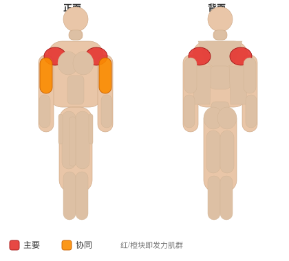
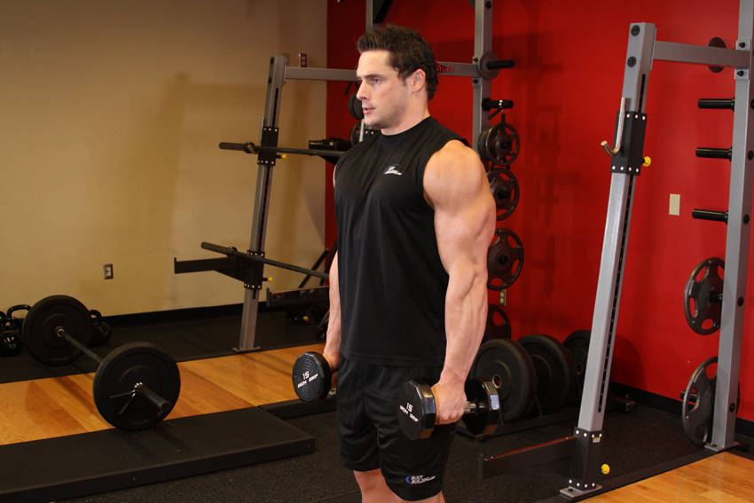

# 哑铃上举

**Dumbbell Raise**

> 部位：肩　|　器械：哑铃　|　难度：⭐ 新手　|　类型：力量训练 · 复合动作 · 拉

## 目标肌群

- **主要**：三角肌
- **协同**：肱二头肌

## 肌肉激活示意

🔴 主要肌群　🟠 协同肌群（红/橙块即发力部位，鼠标悬停看名称）

## 动作示意图

| 起始位 | 结束位 |
|:---:|:---:|
|  |  |

## 动作要点

1. 持哑铃置于身体两侧，手肘保持微屈，肩膀主动下沉。
2. 呼气，用肩部带动手臂向侧上方抬起，想象「用手肘领着走」。
3. 抬到与肩同高即可，再高就变成斜方肌发力了。
4. 顶端停顿半秒，吸气用 2–3 秒缓慢下放，离心才是涨点。
5. 全程小重量、不借力，三角肌有灼烧感就对了。

## 常见错误

- ❌ 耸肩、用斜方肌把重量甩起来 → 练错肌肉
- ❌ 上半身前后晃动借力 → 重量选大了
- ❌ 抬过肩高 → 三角肌中束卸力
- ✅ 沉肩、肘领先、抬到肩高、慢放

## 训练建议

3–5 组 × 6–12 次，组间休息 90–150 秒；先把动作做标准再加重量。

<b>英文原始步骤 / Original Instructions</b>（点击展开）

1. Grab a dumbbell in each arm and stand up straight with your arms extended by your sides with a slight bend at the elbows and your back straight. This will be your starting position. Tip: The dumbbell should be next to your thighs with the palm of your hands facing back.
2. Use your side shoulders to lift the dumbbells as you exhale. The dumbbells should be to the side of the body as you move them up. Continue to lift it until the dumbbells are nearly in line with your chin. Tip: Your elbows should drive the motion. As you lift the dumbbell, your elbow should always be higher than your forearm. Also, keep your torso stationary and pause for a second at the top of the movement.
3. Lower the dumbbells back down slowly to the starting position. Inhale as you perform this portion of the movement.
4. Repeat for the recommended amount of repetitions.

---

[← 返回肩部位索引](README.md)　|　[返回首页](../../README.md)

数据与图片来源：[yuhonas/free-exercise-db](https://github.com/yuhonas/free-exercise-db)（The Unlicense，公有领域）　·　中文名称、动作要点与内容组织：Yue（gengyueworks）