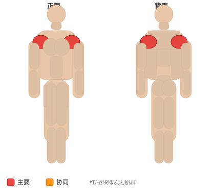
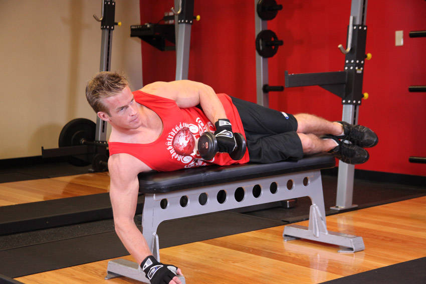

# 肩外旋

**External Rotation**

> 部位：肩　|　器械：哑铃　|　难度：⭐ 新手　|　类型：力量训练 · 孤立动作 · 拉

## 目标肌群

- **主要**：三角肌
- **协同**：—

## 肌肉激活示意

🔴 主要肌群　🟠 协同肌群（红/橙块即发力部位，鼠标悬停看名称）

## 动作示意图

| 起始位 | 结束位 |
|:---:|:---:|
|  |  |

## 动作要点

1. 稳定下半身，骨盆和双脚固定不动——转的是胸椎，不是髋。
2. 核心收紧，脊柱保持中立，不要弓背。
3. 呼气，用腹斜肌带动躯干旋转，眼睛跟随手的方向。
4. 转到有明显侧腹收缩感即可，不追求极限幅度。
5. 吸气缓慢回到中位，再换另一侧，两侧次数保持一致。

## 常见错误

- ❌ 用手臂甩动带动身体 → 腹斜肌不受力
- ❌ 髋部跟着一起转 → 旋转幅度是假的
- ❌ 速度过快 → 腰椎旋转受剪切力
- ✅ 固定骨盆、慢速旋转、两侧对称

## 训练建议

3–4 组 × 10–15 次，组间休息 45–75 秒；小重量找目标肌群的收缩感。

<b>英文原始步骤 / Original Instructions</b>（点击展开）

1. Lie sideways on a flat bench with one arm holding a dumbbell and the other hand on top of the bench folded so that you can rest your head on it.
2. Bend the elbows of the arm holding the dumbbell so that it creates a 90-degree angle between the upper arm and the forearm. Tip: Keep the arm parallel to your torso.
3. Now bend the elbow while keeping the upper arm stationary. In this manner, the forearm will be parallel to the floor and perpendicular to your torso (Tip: So the forearm will be directly in front of you). The upper arm will be stationary by your torso and should be parallel to the floor (aligned with your torso at all times). This will be your starting position.
4. As you breathe out, externally rotate your forearm so that the dumbbell is lifted up in a semicircle motion as you maintain the 90 degree angle bend between the upper arms and the forearm. You will continue this external rotation until the forearm is perpendicular to the floor and the torso pointing towards the ceiling. At this point you will hold the contraction for a second.
5. As you breathe in, slowly go back to the starting position.
6. Repeat for the recommended amount of repetitions and then switch to the other arm.

---

[← 返回肩部位索引](README.md)　|　[返回首页](../../README.md)

数据与图片来源：[yuhonas/free-exercise-db](https://github.com/yuhonas/free-exercise-db)（The Unlicense，公有领域）　·　中文名称、动作要点与内容组织：Yue（gengyueworks）