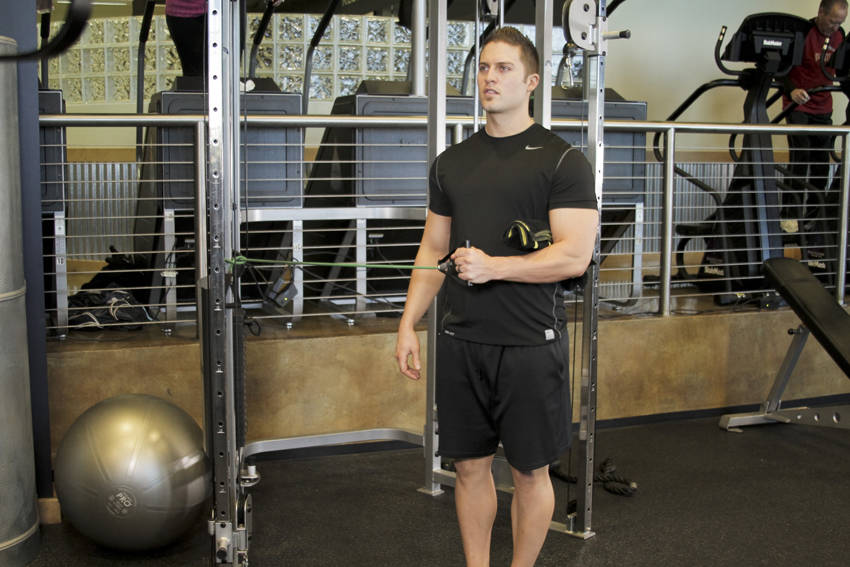

# 弹力带肩外旋

**External Rotation with Band**

> 部位：肩　|　器械：弹力带　|　难度：⭐ 新手　|　类型：力量训练 · 复合动作 · 拉

## 目标肌群

- **主要**：三角肌
- **协同**：—

## 动作示意图

| 起始位 | 结束位 |
|:---:|:---:|
|  |  |

## 动作要点

1. 稳定下半身，骨盆和双脚固定不动——转的是胸椎，不是髋。
2. 核心收紧，脊柱保持中立，不要弓背。
3. 呼气，用腹斜肌带动躯干旋转，眼睛跟随手的方向。
4. 转到有明显侧腹收缩感即可，不追求极限幅度。
5. 吸气缓慢回到中位，再换另一侧，两侧次数保持一致。

## 常见错误

- ❌ 用手臂甩动带动身体 → 腹斜肌不受力
- ❌ 髋部跟着一起转 → 旋转幅度是假的
- ❌ 速度过快 → 腰椎旋转受剪切力
- ✅ 固定骨盆、慢速旋转、两侧对称

## 训练建议

3–5 组 × 6–12 次，组间休息 90–150 秒；先把动作做标准再加重量。

<b>英文原始步骤 / Original Instructions</b>（点击展开）

1. Choke the band around a post. The band should be at the same height as your elbow. Stand with your left side to the band a couple of feet away.
2. Grasp the end of the band with your right hand, and keep your elbow pressed firmly to your side. We recommend you hold a pad or foam roll in place with your elbow to keep it firmly in position.
3. With your upper arm in position, your elbow should be flexed to 90 degrees with your hand reaching across the front of your torso. This will be your starting position.
4. Execute the movement by rotating your arm in a backhand motion, keeping your elbow in place.
5. Continue as far as you are able, pause, and then return to the starting position.

---

[← 返回肩部位索引](README.md)　|　[返回首页](../../README.md)

数据与图片来源：[yuhonas/free-exercise-db](https://github.com/yuhonas/free-exercise-db)（The Unlicense，公有领域）　·　中文名称、动作要点与内容组织：Yue（gengyueworks）
