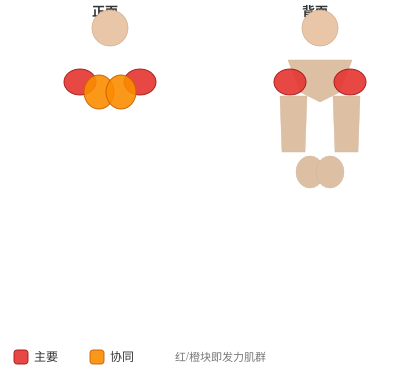
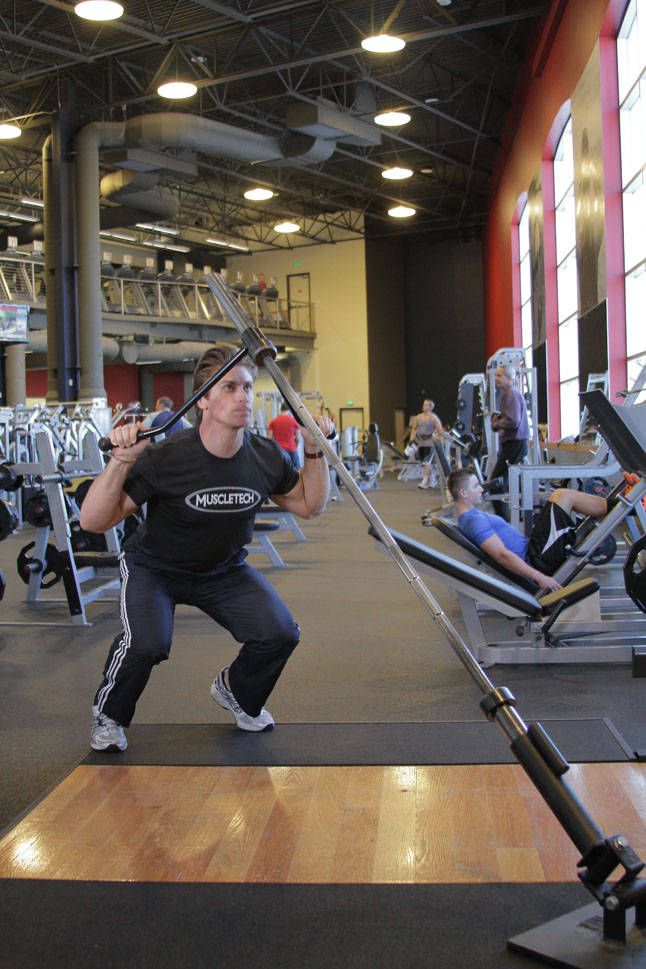
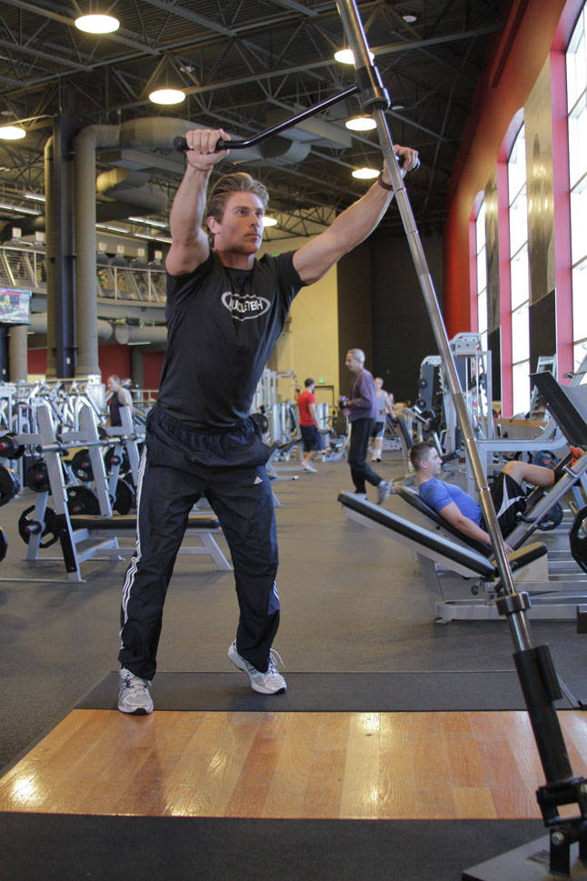

# 杠铃杵直线推举器

**Landmine Linear Jammer**

> 部位：肩　|　器械：杠铃　|　难度：⭐⭐ 进阶　|　类型：力量训练 · 复合动作 · 推

## 目标肌群

- **主要**：三角肌
- **协同**：腹肌、小腿（腓肠肌/比目鱼肌）、胸大肌、腘绳肌（大腿后侧）、股四头肌（大腿前侧）、肱三头肌

## 肌肉激活示意

🔴 主要肌群　🟠 协同肌群（红/橙块即发力部位，鼠标悬停看名称）

## 动作示意图

| 起始位 | 结束位 |
|:---:|:---:|
|  |  |

## 动作要点

1. 调整好起始姿势，用杠铃建立稳定的支撑与握持。
2. 核心收紧、脊柱保持中立，这是所有动作的共同前提。
3. 呼气发力，用三角肌主导完成动作，避免其他部位代偿借力。
4. 在肌肉完全收缩的位置停顿一秒，主动感受三角肌发力。
5. 吸气用 2–3 秒缓慢还原到起始位，全程保持张力不松掉。

## 常见错误

- ❌ 靠身体摆动借力 → 通常意味着重量选大了
- ❌ 只做半程 → 肌肉没有被充分拉长和收缩
- ❌ 屏气硬撑 → 血压骤升，发力时呼气才对
- ✅ 控制节奏、完整幅度、目标肌群主导

## 训练建议

3–5 组 × 6–12 次，组间休息 90–150 秒；先把动作做标准再加重量。

<b>英文原始步骤 / Original Instructions</b>（点击展开）

1. Position a bar into landmine or, lacking one, securely anchor it in a corner. Load the bar to an appropriate weight and position the handle attachment on the bar.
2. Raise the bar from the floor, taking the handles to your shoulders. This will be your starting position.
3. In an athletic stance, squat by flexing your hips and setting your hips back, keeping your arms flexed.
4. Reverse the motion by powerfully extending through the hips, knees, and ankles, while also extending the elbows to straighten the arms. This movement should be done explosively, coming out of the squat to full extension as powerfully as possible.
5. Return to the starting position.

---

[← 返回肩部位索引](README.md)　|　[返回首页](../../README.md)

数据与图片来源：[yuhonas/free-exercise-db](https://github.com/yuhonas/free-exercise-db)（The Unlicense，公有领域）　·　中文名称、动作要点与内容组织：Yue（gengyueworks）