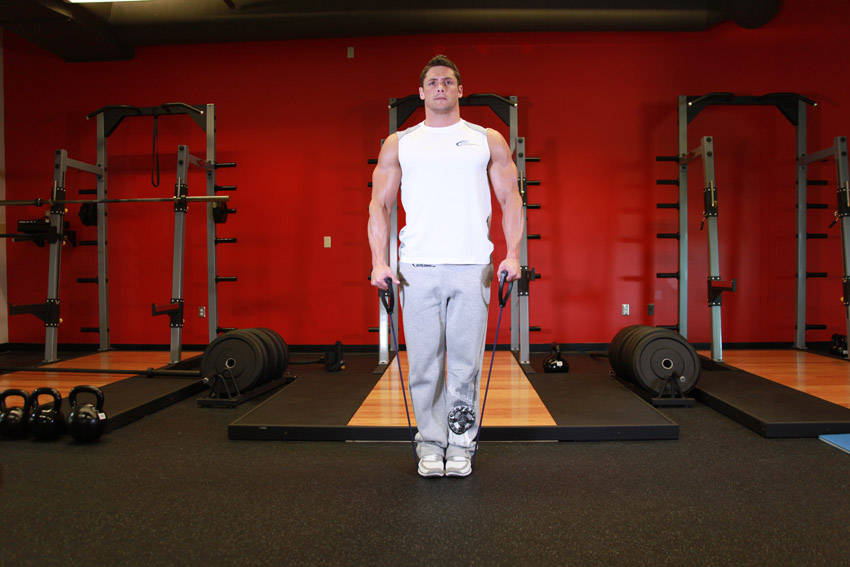
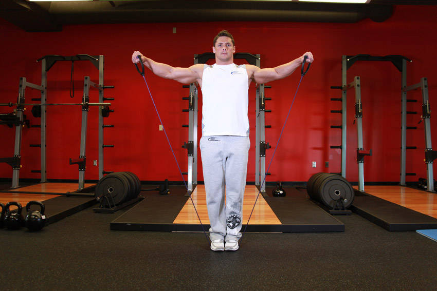

# 侧平举（弹力带）

**Lateral Raise - With Bands**

> 部位：肩　|　器械：弹力带　|　难度：⭐ 新手　|　类型：力量训练 · 孤立动作 · 推

## 目标肌群

- **主要**：三角肌
- **协同**：—

## 动作示意图

| 起始位 | 结束位 |
|:---:|:---:|
|  |  |

## 动作要点

1. 持弹力带置于身体两侧，手肘保持微屈，肩膀主动下沉。
2. 呼气，用肩部带动手臂向侧上方抬起，想象「用手肘领着走」。
3. 抬到与肩同高即可，再高就变成斜方肌发力了。
4. 顶端停顿半秒，吸气用 2–3 秒缓慢下放，离心才是涨点。
5. 全程小重量、不借力，三角肌有灼烧感就对了。

## 常见错误

- ❌ 耸肩、用斜方肌把重量甩起来 → 练错肌肉
- ❌ 上半身前后晃动借力 → 重量选大了
- ❌ 抬过肩高 → 三角肌中束卸力
- ✅ 沉肩、肘领先、抬到肩高、慢放

## 训练建议

3–4 组 × 10–15 次，组间休息 45–75 秒；小重量找目标肌群的收缩感。

<b>英文原始步骤 / Original Instructions</b>（点击展开）

1. To begin, stand on an exercise band so that tension begins at arm's length. Grasp the handles using a pronated (palms facing your thighs) grip that is slightly less than shoulder width. The handles should be resting on the sides of your thighs. Your arms should be extended with a slight bend at the elbows and your back should be straight. This will be your starting position.
2. Use your side shoulders to lift the handles to the sides as you exhale. Continue to lift the handles until they are slightly above parallel. Tip: As you lift the handles, slightly tilt the hand as if you were pouring water and keep your arms extended. Also, keep your torso stationary and pause for a second at the top of the movement.
3. Lower the handles back down slowly to the starting position. Inhale as you perform this portion of the movement.
4. Repeat for the recommended amount of repetitions.

---

[← 返回肩部位索引](README.md)　|　[返回首页](../../README.md)

数据与图片来源：[yuhonas/free-exercise-db](https://github.com/yuhonas/free-exercise-db)（The Unlicense，公有领域）　·　中文名称、动作要点与内容组织：Yue（gengyueworks）
