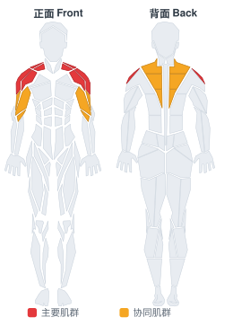
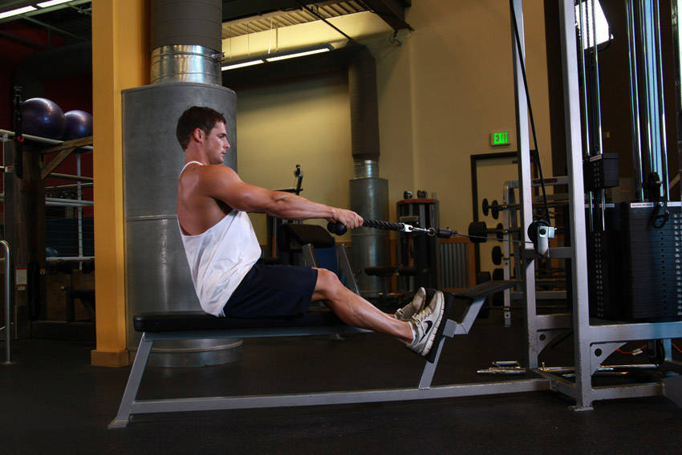

# 低位滑轮划船颈

**Low Pulley Row To Neck**

> 部位：肩　|　器械：绳索　|　难度：⭐ 新手　|　类型：力量训练 · 复合动作 · 拉

## 目标肌群

- **主要**：三角肌
- **协同**：肱二头肌、中背（菱形肌/斜方肌中束）、斜方肌

## 肌肉激活示意

🔴 主要肌群　🟠 协同肌群（红/橙块即发力部位，鼠标悬停看名称）

## 动作示意图

| 起始位 | 结束位 |
|:---:|:---:|
|  |  |

## 动作要点

1. 握住绳索，脊柱保持中立，核心收紧，避免弓背。
2. 起始时让肩胛骨自然前伸，背阔肌被拉长。
3. 呼气，先收肩胛再用手肘向后拉，把绳索带向腹部或下肋位置。
4. 顶峰挤压背部一秒，两侧肩胛向中间夹紧。
5. 吸气缓慢还原，全程躯干稳定不摇摆。

## 常见错误

- ❌ 弓背拉重量 → 腰椎受伤风险最高的错误
- ❌ 靠躯干起伏甩上来 → 背部没吃上力
- ❌ 手肘外展太多 → 变成练后束而非背阔肌
- ✅ 中立脊柱、先收肩胛、肘贴身后拉

## 训练建议

3–5 组 × 6–12 次，组间休息 90–150 秒；先把动作做标准再加重量。

<b>英文原始步骤 / Original Instructions</b>（点击展开）

1. Sit on a low pulley row machine with a rope attachment.
2. Grab the ends of the rope using a palms-down grip and sit with your back straight and your knees slightly bent. Tip: Keep your back almost completely vertical and your arms fully extended in front of you. This will be your starting position.
3. While keeping your torso stationary, lift your elbows and start bending them as you pull the rope towards your neck while exhaling. Throughout the movement your upper arms should remain parallel to the floor. Tip: Continue this motion until your hands are almost next to your ears (the forearms will not be parallel to the floor at the end of the movement as they will be angled a bit upwards) and your elbows are out away from your sides.
4. After holding for a second or so at the contracted position, come back slowly to the starting position as you inhale. Tip: Again, during no part of the movement should the torso move.
5. Repeat for the recommended amount of repetitions.

---

[← 返回肩部位索引](README.md)　|　[返回首页](../../README.md)

数据与图片来源：[yuhonas/free-exercise-db](https://github.com/yuhonas/free-exercise-db)（The Unlicense，公有领域）　·　中文名称、动作要点与内容组织：Yue（gengyueworks）