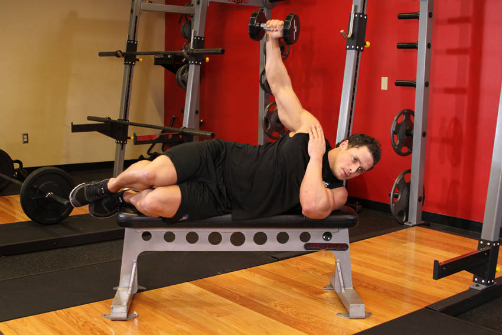

# 仰卧单臂侧平举

**Lying One-Arm Lateral Raise**

> 部位：肩　|　器械：哑铃　|　难度：⭐⭐ 进阶　|　类型：力量训练 · 孤立动作 · 拉

## 目标肌群

- **主要**：三角肌
- **协同**：—

## 肌肉激活示意

🔴 主要肌群　🟠 协同肌群（红/橙块即发力部位，鼠标悬停看名称）

## 动作示意图

| 起始位 | 结束位 |
|:---:|:---:|
|  |  |

## 动作要点

1. 仰卧持哑铃置于身体两侧，手肘保持微屈，肩膀主动下沉。
2. 呼气，用肩部带动手臂向侧上方抬起，想象「用手肘领着走」。
3. 抬到与肩同高即可，再高就变成斜方肌发力了。
4. 顶端停顿半秒，吸气用 2–3 秒缓慢下放，离心才是涨点。
5. 全程小重量、不借力，三角肌有灼烧感就对了。

## 常见错误

- ❌ 耸肩、用斜方肌把重量甩起来 → 练错肌肉
- ❌ 上半身前后晃动借力 → 重量选大了
- ❌ 抬过肩高 → 三角肌中束卸力
- ✅ 沉肩、肘领先、抬到肩高、慢放

## 训练建议

3–4 组 × 10–15 次，组间休息 45–75 秒；小重量找目标肌群的收缩感。

<b>英文原始步骤 / Original Instructions</b>（点击展开）

1. While holding a dumbbell in one hand, lay with your chest down on a flat bench. The other hand can be used to hold to the leg of the bench for stability.
2. Position the palm of the hand that is holding the dumbbell in a neutral manner (palms facing your torso) as you keep the arm extended with the elbow slightly bent. This will be your starting position.
3. Now raise the arm with the dumbbell to the side until your elbow is at shoulder height and your arm is roughly parallel to the floor as you exhale. Tip: Maintain your arm perpendicular to the torso while keeping your arm extended throughout the movement. Also, keep the contraction at the top for a second.
4. Slowly lower the dumbbell to the starting position as you inhale.
5. Repeat for the recommended amount of repetitions.

---

[← 返回肩部位索引](README.md)　|　[返回首页](../../README.md)

数据与图片来源：[yuhonas/free-exercise-db](https://github.com/yuhonas/free-exercise-db)（The Unlicense，公有领域）　·　中文名称、动作要点与内容组织：Yue（gengyueworks）