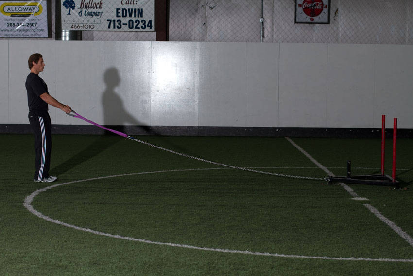

# 雪橇反向飞鸟

**Sled Reverse Flye**

> 部位：肩　|　器械：其他　|　难度：⭐ 新手　|　类型：力量训练 · 孤立动作 · 拉

## 目标肌群

- **主要**：三角肌
- **协同**：—

## 肌肉激活示意

🔴 主要肌群　🟠 协同肌群（红/橙块即发力部位，鼠标悬停看名称）

## 动作示意图

| 起始位 | 结束位 |
|:---:|:---:|
|  |  |

## 动作要点

1. 力量人项目对场地、器材和保护要求高，务必确认环境安全。
2. 起始动作与硬拉一致：屈髋屈膝、挺胸、背部中立、核心绷紧。
3. 发力时髋腿主导，全身作为一个整体输出，避免局部代偿。
4. 全程保持呼吸节奏，重负荷下不要长时间憋气。
5. 结束时有控制地放下器械，不要直接甩手。

## 常见错误

- ❌ 弓背发力 → 腰椎损伤
- ❌ 无人保护挑战极限重量 → 安全隐患
- ❌ 技术不熟就加重量 → 事故高发
- ✅ 先练技术、确保保护、整体发力

## 训练建议

3–4 组 × 10–15 次，组间休息 45–75 秒；小重量找目标肌群的收缩感。

<b>英文原始步骤 / Original Instructions</b>（点击展开）

1. Attach dual handles to a sled connected by a rope or chain. Load the sled to a light weight.
2. Face the sled, backing up until there is some tension in the line. Take both handles at arms length at about waist level. Bend the knees slightly and keep your chest and head up. This will be your starting position.
3. Without flexing the elbow, pull the handles upward and apart, performing a reverse fly with some external rotation. Your palms should be facing forward as you do this.
4. Return to the starting position, taking a couple steps back to take the slack out of the line.

---

[← 返回肩部位索引](README.md)　|　[返回首页](../../README.md)

数据与图片来源：[yuhonas/free-exercise-db](https://github.com/yuhonas/free-exercise-db)（The Unlicense，公有领域）　·　中文名称、动作要点与内容组织：Yue（gengyueworks）