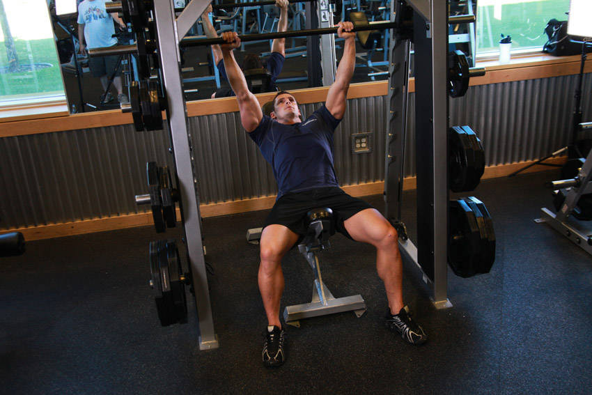

# 史密斯机上斜肩上举

**Smith Incline Shoulder Raise**

> 部位：肩　|　器械：杠铃　|　难度：⭐ 新手　|　类型：力量训练 · 孤立动作 · 推

## 目标肌群

- **主要**：三角肌
- **协同**：胸大肌

## 动作示意图

| 起始位 | 结束位 |
|:---:|:---:|
|  |  |

## 动作要点

1. 上斜持杠铃置于身体两侧，手肘保持微屈，肩膀主动下沉。
2. 呼气，用肩部带动手臂向侧上方抬起，想象「用手肘领着走」。
3. 抬到与肩同高即可，再高就变成斜方肌发力了。
4. 顶端停顿半秒，吸气用 2–3 秒缓慢下放，离心才是涨点。
5. 全程小重量、不借力，三角肌有灼烧感就对了。

## 常见错误

- ❌ 耸肩、用斜方肌把重量甩起来 → 练错肌肉
- ❌ 上半身前后晃动借力 → 重量选大了
- ❌ 抬过肩高 → 三角肌中束卸力
- ✅ 沉肩、肘领先、抬到肩高、慢放

## 训练建议

3–4 组 × 10–15 次，组间休息 45–75 秒；小重量找目标肌群的收缩感。

<b>英文原始步骤 / Original Instructions</b>（点击展开）

1. Place an incline bench underneath the smith machine. Place the barbell at a height that you can reach when lying down and your arms are almost fully extended. Once the weight you need is selected, lie down on the incline bench and make sure your shoulders are aligned right under the barbell.
2. Using a shoulder width pronated (palms forward) grip, lift the bar from the rack and hold it straight over you with a slight bend at the elbows. This will be your starting position.
3. As you breathe out, lift the bar up until your arms are fully extended. Note: The contraction should be felt around the shoulders.
4. After a second pause, bring the bar back down to the starting position as you breathe in.
5. Repeat the movement for the prescribed amount of repetitions.
6. When you are done, place the bar back in the rack.

---

[← 返回肩部位索引](README.md)　|　[返回首页](../../README.md)

数据与图片来源：[yuhonas/free-exercise-db](https://github.com/yuhonas/free-exercise-db)（The Unlicense，公有领域）　·　中文名称、动作要点与内容组织：Yue（gengyueworks）
