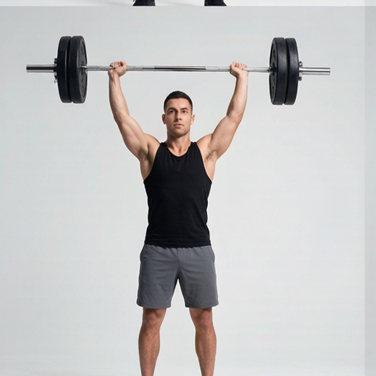
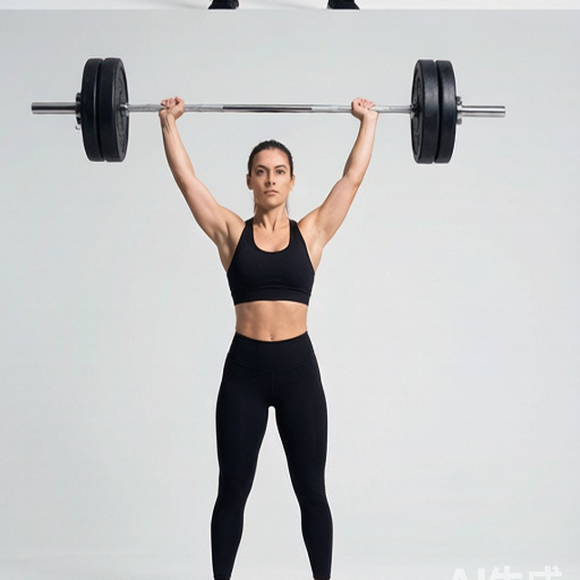

# 站姿军推

**Standing Military Press**

> 部位：肩　|　器械：杠铃　|　难度：⭐ 新手　|　类型：力量训练 · 复合动作 · 推

## 目标肌群

- **主要**：三角肌
- **协同**：肱三头肌

## 肌肉激活示意

🔴 主要肌群　🟠 协同肌群（红/橙块即发力部位，鼠标悬停看名称）

## 动作示意图

|  | 起始位 | 结束位 |
|:---:|:---:|:---:|
| **男性** |  |  |
| **女性** |  |  |

## 动作要点

1. 站姿握住杠铃，起始位置在锁骨/下巴高度，手腕在手肘正上方。
2. 核心和臀部收紧，肋骨不要外翻，避免用腰代偿。
3. 呼气竖直向上推，过头后手臂位于耳侧或略靠后。
4. 顶端肩胛骨自然上回旋，手肘不完全锁死。
5. 吸气沿原轨迹控制下放到起始位，不要砸下来。

## 常见错误

- ❌ 挺腰后仰把肩推变成上斜卧推 → 腰椎吃力
- ❌ 杠铃走「之」字绕过下巴 → 轨迹低效
- ❌ 手腕后折 → 腕关节疼痛
- ✅ 收紧核心、直上直下、手腕中立

## 训练建议

3–5 组 × 6–12 次，组间休息 90–150 秒；先把动作做标准再加重量。

<b>英文原始步骤 / Original Instructions</b>（点击展开）

1. Start by placing a barbell that is about chest high on a squat rack. Once you have selected the weights, grab the barbell using a pronated (palms facing forward) grip. Make sure to grip the bar wider than shoulder width apart from each other.
2. Slightly bend the knees and place the barbell on your collar bone. Lift the barbell up keeping it lying on your chest. Take a step back and position your feet shoulder width apart from each other.
3. Once you pick up the barbell with the correct grip length, lift the bar up over your head by locking your arms. Hold at about shoulder level and slightly in front of your head. This is your starting position.
4. Lower the bar down to the collarbone slowly as you inhale.
5. Lift the bar back up to the starting position as you exhale.
6. Repeat for the recommended amount of repetitions.

---

[← 返回肩部位索引](README.md)　|　[返回首页](../../README.md)

数据与图片来源：[yuhonas/free-exercise-db](https://github.com/yuhonas/free-exercise-db)（The Unlicense，公有领域）　·　中文名称、动作要点与内容组织：Yue（gengyueworks）